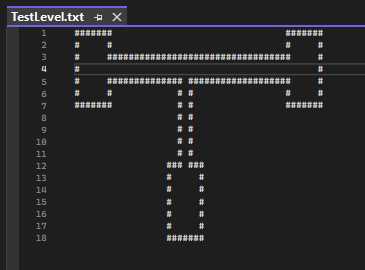
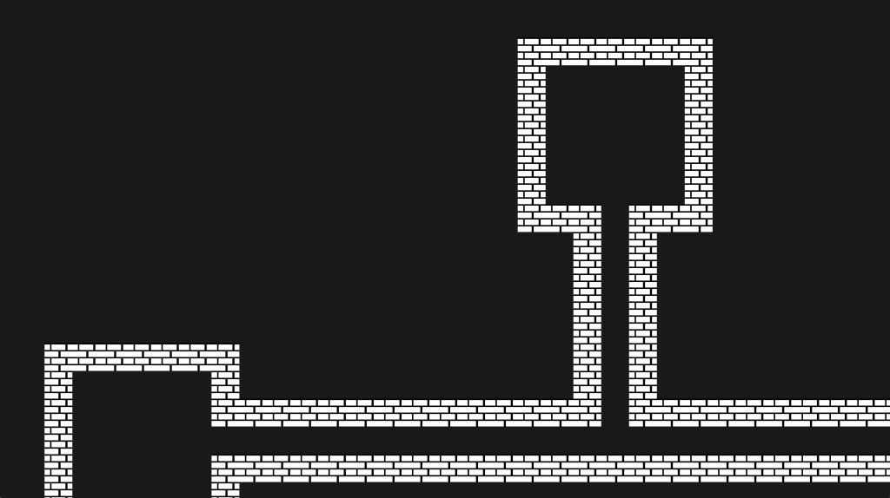
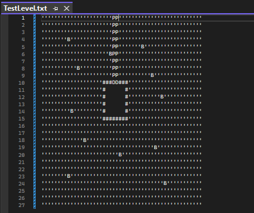
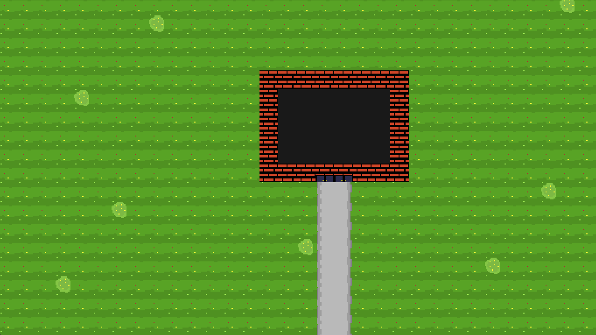

# Quartz

## Overview
Quartz is a 2D game engine which I am developing in my free time, the current goal of Quartz is to have a lightweight game engine that I can extend with features depending on the kind of games I am interested in developing.

Currently Quartz only supports OpenGL, however the engine does have an abstract Renderer class meaning that the engine isn't confined to OpenGL and other graphic APIs such as DirectX or Vulkan can easily be integrated without any added trouble. Levels can quickly be created by populating a .txt file with symbols which represent different textures, in the example below the hash symbol is being used to represent a simple brick wall. These .txt files can then be loaded into the engine's Level Library and then used to draw a level as required.

  
  

This method of level rendering can be extended with new symbols as the level demands more scenery for the player to look at. In the example below, the path leading from the house is being rendered by checking if it is horizontally adjacent to another path symbol and binding the correct path texture. Stuff like this makes it an awful lot simpler to define a path in the txt file, since you don't need to worry about having different combos of symbols depending on the kind of path you want.

  
  

## External libraries
- GLAD
- GLFW
- GLM
- ImGui
- spdlog
- stb
